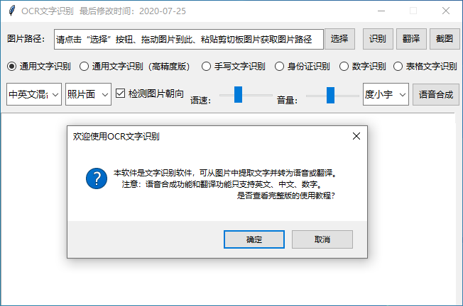

## OCR文字识别

本软件是文字识别软件（可以从图片中提取文字并将提取出来的文字转为语音）。由于接入了百度api，故识别准确率较高，且具有通用文字识别、手写文字识别、身份证识别、数字识别、表格文字识别、语音合成（只支持中英文）及翻译（只支持中译英和英译中）功能。

## 运行

安装依赖：python -m pip install --upgrade pip && pip install requests windnd pillow pywin32

运行：python main.py

## GUI界面

